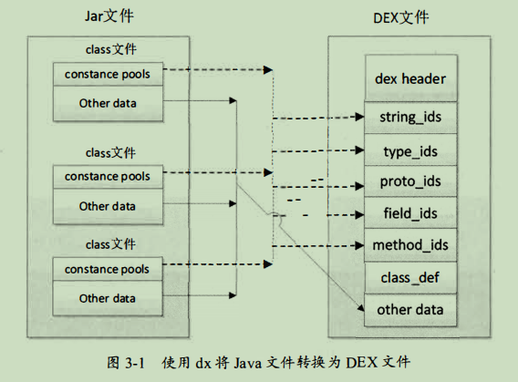
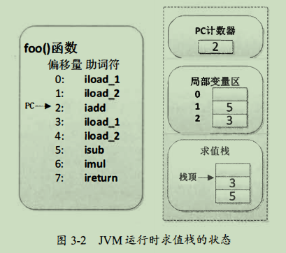
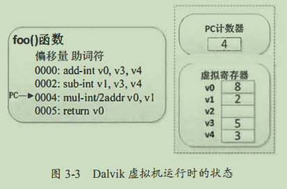
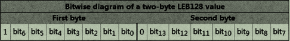
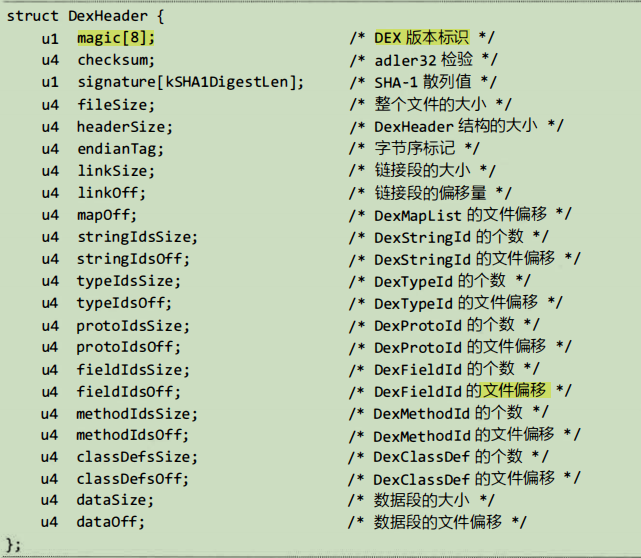
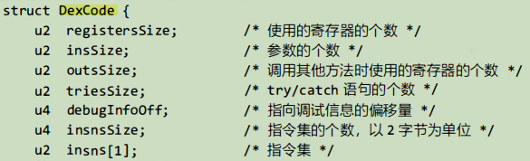

## 1.Dalvik虚拟机

>1. **特点**
>
>  * 体积小， 占用内存空间少。
>  * 专有的DEX ( Dalvik Exe c utable ）可执行文件格式， 体积小， 执行速度快。
>  * 常量池采用32位索引值， 对类方法名、 字段名、 常量的寻址速度快。
>  * 基于寄存器架构， 同时拥有 一套完整的指令系统。
>  * 提供了对象生命周期管理、 堆枝管理、 线程管理、 安全和异常管理及垃圾回收等重要功能。
>  * 所有的Android程序都运行在Android系统进程中， 每个进程都与一个 Dalvik虚拟机实例对应。
>
>2. **Dalvik虚拟机与Java虚拟机的区别**
>
>  * 运行的字节码不同
>
>  * Dalvik可执行文件的体积更小。(dx工具：将Java字节码转换为Dalvik字节码)
>
>    dx对所有Java类文件中的常量池进行了分解， 消除了其中的冗余信息，然后将它们重新组合形成一个常量池，并让所有类文件共享这个常量池。
>
>    
>
>  * 虚拟机架构不同
>
>    java: 基于`栈架构`。
>
>    Dalvik: 基于`寄存器架构`。
>
>    
>
>    iload_1：i表示int类型，load表示将局部变量存入Java栈，1表示要操作的哪个局部变量。
>
>    
>
>    
>
>    add-int v0,v3,v4：将v3与v4相加，并将值存入v0。
>
>3. 虚拟机的执行方式
>
>  * 即时编译（Just-in-time Compilation ，JIT）又称动态编译， 是一种通过在运行时将字节码翻译为机器码使得程序的执行速度加快的技术。
>  * 主流的JIT包括两种字节码编译方式
>    * method方式：以函数或方法为单位进行编译。
>    * trace方式：以trace为单位进行编译。

## 2.Dalvik 语言基础

>  1. **Dalvik字节码**
>
>  >* **类型**
>  >
>  >  * 基本类型
>  >
>  >  * 引用类型
>  >
>  >  * Dalvik字节码类型描述符
>  >
>  >    |   语法   |    Z    |  B   |  J   |     L      |  [   |
>  >    | :------: | :-----: | :--: | :--: | :--------: | :--: |
>  >    | **含义** | boolean | byte | long | Java类类型 | 数组 |
>  >
>  >  * Lpackage/name/ObjectName；
>  >
>  >    L 表示后面眼着一 个Java类，package/name/表示对象所在 的包，ObjectName表示对象的名称，分号表示对象名结束。
>  >
>  >* **方法**
>  >
>  >  * ```javascript
>  >    Lpackage/name/ObjectName;->MethodName(III)Z
>  >    ```
>  >
>  >    MethodName为具体的方法名，(III)Z是方法的签名部分， 括号内的III 为方法的参数（在此为三个整型参数)，z表示方法的返回类型。
>
>  ****
>
>  2. **Dalvik指令集**
>
>  * 指令类型
>
>    * ```javascript
>      move-wide/from16 vAA, vBBBB
>      ```
>
>      * move为基础字节码；
>
>      * -wide为名称后缀，表示指令操作 的数据宽度(64位)；
>
>      * from16为字节码后缀，表示源为一个16位的寄存器引用变量；
>
>      * vAA为目的寄存器，取值范围为v0～v255；
>
>      * vBBBB为源寄存器， 取值范围为v0～v65535；
>
>    * 空操作指令
>
>      * 助记符为nop,值为00；
>
>    * 数据操作指令
>
>      * ```javascript
>        move-wide vA, vB
>        ```
>
>        指令用于为4位的寄存器对赋值， 源寄存器与目的寄存器都为4位。
>
>      * ```javascript
>        move-result vAA
>        ```
>
>        指令用于将上 一 个invoke类型指令操作的单字非对象结果赋予vAA寄存器。
>
>    * 返回指令
>
>      * ```javascript
>        return vAA
>        ```
>
>        指令表示函数返回 一 个32位非对象类型的值， 返回值为8位寄存器vAA。
>
>    * 数据定义指令
>
>      * ```javascript
>        const/16 vAA, #+BBBB
>        ```
>
>        指令用于将数值符号扩展为32位后赋予寄存器vAA。
>
>    * 锁指令
>
>      * | monitor-enter vAA | monitor-exit vAA |
>        | :---------------: | :--------------: |
>        | 为指定对象获取锁  | 释放指定对象的锁 |
>
>    * 实例操作指令
>
>      * ```javascript
>        check-cast vAA, type@BBBB
>        ```
>
>        指令用于将vAA寄存器中的对象引用转换成指定的类型。
>
>      * ```javascript
>        new-instance vAA, type@BBBB
>        ```
>
>        指令用于构造一个指定类型对象的新实例， 并将对象引用赋值给vAA寄存器 。 类型符type指定的类型不能是数组类。
>
>      * ```javascript
>        instance-of vA, vB, type@CCCC
>        ```
>
>        指令用于判断vB寄存器中的对象引用是否可以转换成指定的类型，如果可以就为vA寄存器赋值1，否则为vA寄存器赋值为0。
>
>    * 数组操作指令
>
>      * ```javascript
>        array-length vA, vB
>        ```
>
>        指令用于获取给定vB寄存器中数组的长度， 并将值赋予vA寄存器。
>
>      * ```javascript
>        arrayop vAA, vBB, vCC
>        ```
>
>        * 指令用于对vBB寄存器指定的数组元素进行取值与赋值；
>        * vCC寄存器用于指定数组元素的索引；
>        * vAA寄存器用于存放读取的或需要设置的数组元素的值；
>        * 读取元素时使用aget类指令， 为元素赋值时使用aput类指令；
>        
>      * ```javascript
>        new-array vA, vB, type@CCCC
>        ```
>
>        指令用于构造指定类型（type@CCCC ）和大小（vB）的数组，并将值赋予vA寄存器。
>
>    * 跳转指令
>
>      * 无条件跳转指令goto
>
>        ```javascript
>        goto/16 +AAAA
>        ```
>
>        指令用于无条件跳转到指定偏移处， 偏移量 AAAA不能为0。
>
>      * ```javascript
>        packed-switch vAA, +BBBBBBBB
>        ```
>
>        * 分支跳转指令，vAA寄存器为switch分支中需要判断的值，BBBBBBBB指向一个packed-switch -payload格式的偏移表， 表中的值是递增的偏移量。
>        * 若packed改为sparse，则表中的值是无规律的偏移量。
>
>      * ```javascript
>        if-test vA, v8, +CCC
>        ```
>
>        * if-test类型指令如下
>
>          |  smali   |   if-eq    |   if-ne    |   if-lt   |   if-ge    |   if-gt   |   if-le    |
>          | :------: | :--------: | :--------: | :-------: | :--------: | :-------: | :--------: |
>          | **java** | if(vA==vB) | if(vA!=vB) | if(vA<vB) | if(vA>=vB) | if(vA>vB) | if(vA<=vB) |
>
>      * ```javascript
>        if-testz vAA, +BBBB
>        ```
>
>        * 指令将vAA寄存器的值与0进行比较，若比较结果满足或值为0，就跳转。
>
>    * 比较指令
>
>      * | cmpl-float                                         | cmpg-float          | cmpl -double             | cmpg-double             |
>        | :------------------------------------------------- | ------------------- | ------------------------ | ----------------------- |
>        | 若vBB>vCC，结果为-1; 若=，则结果为0;若<，则结果为1 | 若vBB>vCC，结果为1. | 若vBB对>vCC对，结果为-1. | 若vBB对>vCC对，结果为1. |
>
>    * 字段操作指令
>
>      * 普通字段的指令前缀为i。
>      * 静态字段的指令前缀为s。
>
>    * 数据运算指令
>
>      | binop vAA, vBB, vCC | 将vBB 寄存器与vCC 寄存器进行运算， 将运算结果保存到vAA寄存器中 |
>      | ------------------- | ------------------------------------------------------------ |
>      | **binop/2addr  vA, vB** | **将vA寄存器与 vB寄存器进行运算， 将运算结果保存到vA寄存器中** |
>      | **rem-type**        | **vBB % vCC**                                                |
>      | **shl-type**        | **vBB << vCC**                                             |
>
>    
>
>

## 3.Android文件格式

>1. **库文件**
>
>>  1. jar包
>>     * zip格式的压缩包文件，放着编译后Java代码的class文件的集合。
>>  2. aar包
>>     * 既包含了代码，又包含了开发中所有使用的资源数据，解决了手动复制图片，声音，布局等资源的繁琐。
>
>2. **APK**
>
>3. **classes.dex**
>
>>​														**DEX文件使用的数据类型**
>>
>>| 自定义类型 |  原类型  |            含义             |
>>| :--------: | :------: | :-------------------------: |
>>|     s1     |  int8_t  |        8位有符号整型        |
>>|     u1     | uint8_t  |        8位无符号整型        |
>>|     s2     | int16_t  | 16位有符号整型，小端字节序  |
>>|     u2     | uint16_t | 16位无符号整型， 小端字节序 |
>>|     s4     | int32_t  | 32位有符号整型， 小端字节序 |
>>|     u4     | uint32_t | 32位无符号整型， 小端字节序 |
>>|     s8     | int64_t  | 64位有符号整型， 小端字节序 |
>>|     u8     | uint64_t | 64位无符号整型， 小端字节序 |
>>|  sleb128   |    无    |   有符号LEB128， 可变长度   |
>>|  ulebl28   |    无    |   无符号LEB128，可变长度    |
>>| ulebl28pl  |    元    |  无符号LEB128加1，可变长度  |
>>
>>* 每个LEB128由I～5字节组成，所有的字节组合在一起表示一个32位的数据
>>
>>
>>
>>* 每个字节只有7位为有效位， 如果第l个字节的最高位为1， 表示LEB128需要使用第2个字节， 如果第2个字节的最高位为l， 表示会使用第3个字节， 依此类推， 直到最后 一个字节的最高位为0为止。 当然，LEB128最多使用5字节， 如果读取5字节后下一个字节的最高位仍为1， 则表示该DEX文件无效 ， Dalvik虚拟机在验证DEX文件时会失败井返回。
>>
>> ****
>>
>>  ​														**DEX文件的结构体**
>>
>>* | dex header     | DEX 文件头         |
>>  | :------------- | ------------------ |
>> | **string_id**  | **索引结构区**     |
>> | **type_ids**   | ...                |
>> | **proto_ids**  | ...                |
>> | **field_ids**  | ...                |
>> | **method_ids** | ...                |
>> | **class_def**  | ...                |
>> | **data**       | **真实的数据**     |
>> | **link_data**  | **静态链接数据区** |
>>
>>****
>>
>>* 
>>* `magic`字段：表示这是一个有效的DEX文件， 目前它的值固定为 “64 65 78 Oa 30 33 35 00”
>>* `checksum`字段：DEX文件的校验和，可以判断DEX文件是否已经损坏或被篡改
>>* `signature`字段：识别未经dexopt优化的DEX文件
>>* `filesize`字段：记录了包括DexHeade在内的整个DEX文件的大小
>>* `headerSize`字段：记录了DexHeader结构本身占用的字节数
>>* `endianTag`字段：指定了DEX运行环境的CPU字节序， 预设值ENDIAN_CONSTANT等于0x12345678， 表示默认采用小端字节序
>>* `linkSize与linkOff`字段：分别指定了链接段的大小与文件偏移， 在大多数情况下它们的值为0
>>* `mapOff`字段：指定了DexMapList结构的文件偏移
>>* 接下来的字段则分别表示 DexStringId、DexTypeId、DexProtoId、DexFieldId、DexMethodId、DexClassDef及数据段的大小与文件偏移
>>
>>****
>>
>>* 
>>* `registersSize`字段：指定了方法中使用的寄存器的个数。(对应于smali语法中.registerd的值)
>>* `insSize`字段：指定了方法的参数的个数（对应于.paramter）
>>* `outsSize`字段：指定了方法在调用外部方法时使用的寄存器的个数
>>* `triesSize`字段：指定了方法中try/catch语句的个数
>>* `insnsSize`字段：指定了接下来的指令的个数
>>* `insns`字段：真正的代码部分
>>
>>****
>>
>
>4.**AndroidManifest.xml**
>
>>```java
>>android:allowBackup＝ ''true''
>>```
>>
>>android:allowBackup允许系统 在进行备份操作时备份程序的应用数据， 典型的操作是在终端执行 adb backup命令， 或者点击手机设置界面上的 “备份操作 ” 按钮。
>>
>>```java
>>android:supportsRtl＝ ''true''
>>```
>>
>>这个标签的作用是让APK支持 RTL ( Right-to-Left )视图。
>>
>>**AXML文件格式**
>>
>>Android Studio 在编译APK文件时， 会将AndroidManifest.xml处理后打包进去。打包进
>>
>>去的AndroidManifest.xml被编译成了二进制格式的文件，这个打包后的AndroidManifest.xml
>>
>>称为 "AXML"。
>>
>>**AXML文件结构**
>>
>>文件头`ResFileheader`，字符串池`ResStringPool`，资源ID块`ResIDs`，XML数据内容块`ResXMLTree`四部分线性地组成。
>>
>>`ResFileheader`表示文件的头部， 在这里用`ResChunk_header`表示，其定义如下：
>>
>>```java
>>struct ResChunk_header
>>{
>>	uint16_t type;
>>	uint16_t headerSize;
>>	uint32_t size;
>>}
>>```
>>
>>`type`字段描述了`chunk`所属结构体的类型。`header_size`字段表示当前`ResChunk_header`结构的大小。`file_size`字段表示该`chunk`结构体数据的长度。
>>
>>字符串池ResStringPool ，它包含了AXML中使用的所有字符串
>>
>>
>
>
>
>
>
>


